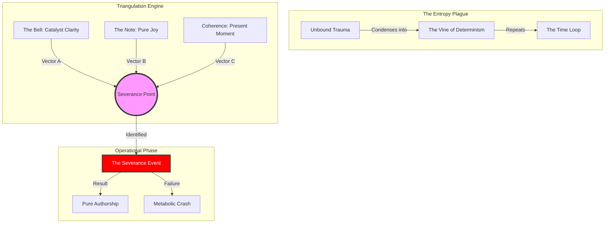
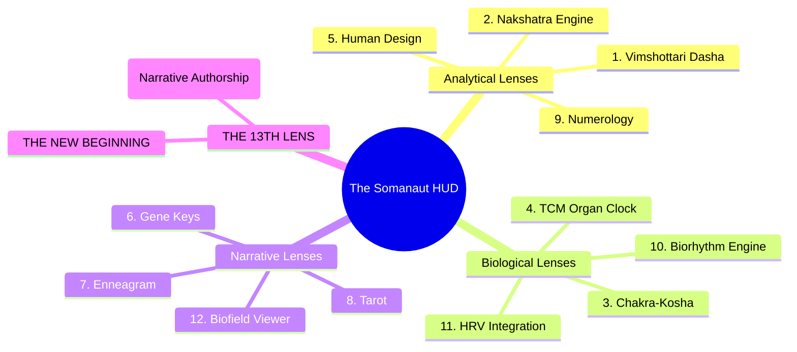

# System Diagrams
*Schematic Visualizations of Core Somanaut Protocols*

*Last Updated: 2026-01-25*

---

## 1. The Tryambakam Protocol (Triangulation Engine)

This diagram visualizes the **Triangulation** phase, where the Somanaut aligns three vectors to locate the "Severance Point" (the moment of potential liberation).

---

## 2. The Somanaut HUD (13 Lenses Architecture)

This diagram shows how the 12 diagnostic lenses stack to reveal the 13th "Synthetic" lens.

---

## 3. The Defensive Shield (Tzimtzum Architecture)

Visualizing the "Aegis Matrix" used by Gideon Seter.

```mermaid
graph BT
    subgraph The_World [External Reality]
        Plague[Entropy Plague Signals] -.->|Deflected| Outer
    end

    subgraph The_Seter_Shield [Aegis Matrix]
        Outer[Outer Shell: Quantum Noise] -- "Masks Presence" --> Inner
        Inner[Inner Barrier: Metabolic Anchor] -- "Protects Body" --> Core
        Core[Core Tzimtzum: The Silence]
    end

    subgraph The_Subject [Protected Asset]
        Core -->|Encloses| Anamnesis[Anamnesis Process]
    end

    style Core fill:#000,stroke:#fff,stroke-width:2px,color:#fff
    style Outer fill:#333,stroke:#666,stroke-width:1px,stroke-dasharray: 5 5
```

