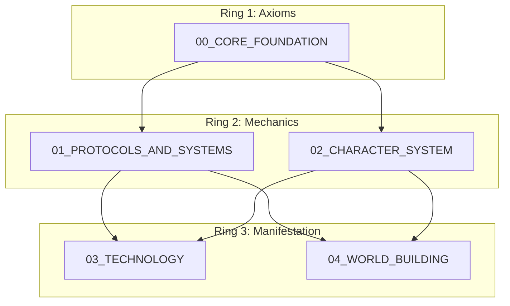

# THE WORLD BIBLE NAVIGATOR

> *"The map is not the territory, but it is the only way to find the door."* — Dr. Jian Quoril

## SYSTEM ARCHITECTURE
This repository is organized into five concentric rings of knowledge.

## DIRECTORY INDEX

### 1. [CORE FOUNDATION](./00_CORE_FOUNDATION/)
**The Source Code.**
*   Start here: `00_SERIES_BIBLE.md`
*   Key Definitions: `03_LEXICON_OF_NOESIS.md`
*   Data Graph: `somatic_canticles_data_tapestry.json`

### 2. [PROTOCOLS & SYSTEMS](./01_PROTOCOLS_AND_SYSTEMS/)
**The Laws of Physics.**
*   Magic System: `00_TRYAMBAKAM_PROTOCOL.md`
*   Writing Style: `01_BIOLOGICAL_STYLE_GUIDE.md`
*   Symbolism: `The_13_Symbolic_Lenses.md`

### 3. [CHARACTER SYSTEM](./02_CHARACTER_SYSTEM/)
**The Operators.**
*   The Team: `02-SOMANAUT-TEAM-ROSTER.md`
*   The Journey: `TRILOGY-CHARACTER-ARCS.md`
*   The Map: `CONSCIOUSNESS_TERRITORIES.md`

### 4. [TECHNOLOGY](./03_TECHNOLOGY/)
**The Tools.**
*   Wetware: `Bio_Engineering/`
*   Hardware: `Consciousness_Interfaces/`
*   Software: `System_Operations/`

### 5. [WORLD BUILDING](./04_WORLD_BUILDING/)
**The Territory.**
*   Politics: `00_GALACTIC_FEDERATION_CHARTER.md`
*   Cultures: `01_SEVEN_GALACTIC_CULTURES.md`
*   History: `Expanded_Context/HISTORICAL-AND-CULTURAL-LORE.md`

## META-DATA REGISTRY
For machine-readable access to this structure, refer to:
`00_CORE_FOUNDATION/world_bible_registry.json`

## HOW TO ADD NEW LORE
1.  **Categorize**: Determine the Domain (Ring 1, 2, or 3).
2.  **Draft**: Create the markdown file in the appropriate subdirectory.
3.  **Register**: Add the file entry to `world_bible_registry.json`.
4.  **Link**: Add a node to `somatic_canticles_data_tapestry.json` connecting it to existing concepts.
