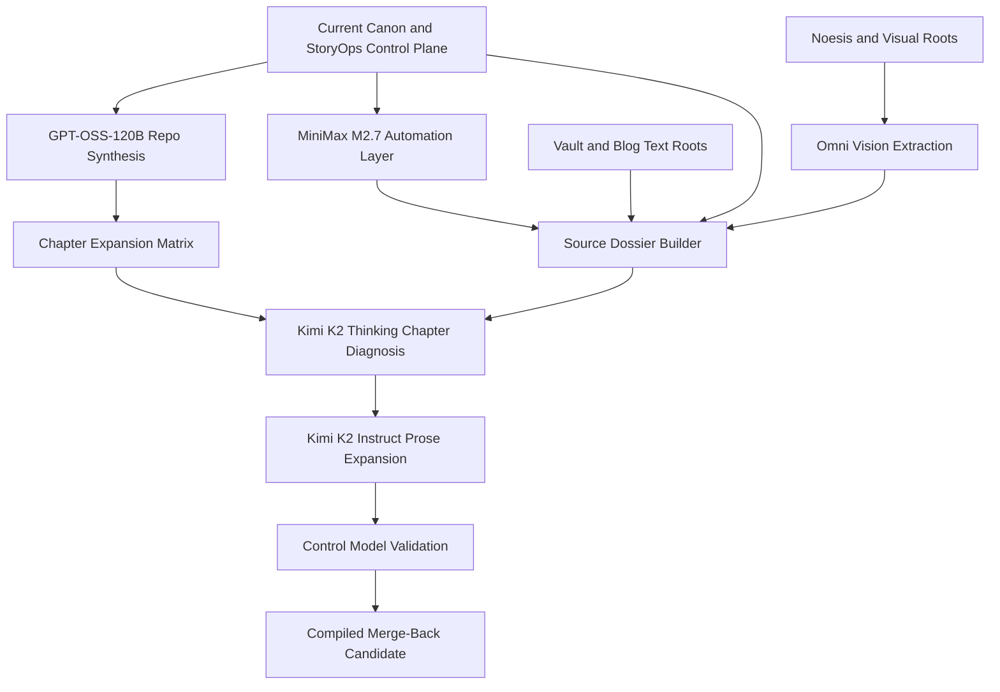

# NVIDIA Expansion Lab

This folder is the isolated planning and execution surface for the long-form trilogy expansion pass.

It exists to lengthen and deepen the current compiled trilogy without discarding the canon, StoryOps rules, editorial doctrine, or chapter-by-chapter logic already proven in the main repo.

Current macro target:

- grow the active working lane from `45,902` words toward a full trilogy band of `300,000-400,000` words
- treat the earlier `3x` baseline as an intermediate safety floor, not the actual end state

## Purpose

- preserve the current compiled trilogy as canon while expansion work is staged elsewhere
- use the existing StoryOps and editorial surfaces as the control plane
- route different NVIDIA models to distinct jobs so the prose stops inheriting one-model sameness
- turn vault, blog, noesis, and world-bible material into chapter-bound source dossiers instead of loose inspiration
- keep the tarot / enneagram / endocrine-muse symbolic spine implicit and defaulted to Toth/Crowley logic rather than Rider–Waite naming drift

## Control Inputs

- `../outline.md`
- `../chapter_summaries.md`
- `../book_rules.md`
- `../dialogue_voice_matrix.md`
- `../emotional_arcs.md`
- `../subplot_board.md`
- `../character_matrix.md`
- `../../../../01_WORLD_BIBLE/02_CHARACTER_SYSTEM/TRILOGY-CHARACTER-ARCS.md`
- `../../../../03_EDITORIAL/EDITORIAL_BRIEF.md`
- `../../../../03_EDITORIAL/03_STYLE_GUIDE/MASTER_STYLE_SHEET.md`
- `../../../../03_EDITORIAL/book1_anamnesis_engine_tasks.json`
- `../../../../03_EDITORIAL/book2_myocardial_chorus_tasks.json`
- `../../../../03_EDITORIAL/book3_the_ripening_tasks.json`
- `/Volumes/madara/2026/twc-vault/.claude/skills/noesis-writer-skill/SKILL.md` as a supplemental structured-tone reference only, not a replacement control plane

## Supplemental Tone Reference

Use the local `noesis-writer-skill` as a secondary tone scaffold when expansion prose starts flattening.

Borrow from it:

- grounded, direct, respectful-challenging sentence posture
- `PubMed x Alex Grey` precision at visionary scale
- humor as structural relief: funny because true at multiple scales
- conviction over hedging
- source-lattice discipline as a reminder that tonal density should still come from real substrate

Do not borrow from it:

- platform formatting rules
- content-marketing closure habits
- publishing/pipeline assumptions
- editorial image generation requirements
- public-channel brand constraints that are not trilogy-native

## Source Material Roots

### Tier A: Published text substrate

- `/Volumes/madara/2026/twc-vault/01-Projects/tryambakam-noesis/synchronocities-blog/src/content/posts`

Use for:

- public conceptual substrate
- runtime, compassion, pattern, endocrine, and authorship language
- chapter-bound lore deepening that still reads like trilogy-native material

### Tier B: Vault research support

- `/Volumes/madara/2026/twc-vault/03-Resources`

Use selectively for:

- research deepening
- biological and consciousness-adjacent pressure
- symbolic and governance support

Do not ingest this root indiscriminately. Every file must be chapter-bound and dossier-justified.

### Tier C: Area notebooks and concept hubs

- `/Volumes/madara/2026/twc-vault/02-Areas`

Priority subfamilies:

- `Consciousness-Models`
- `Pattern-Studies`
- `Technical-Mystical-Integration`
- `Bioelectric-Body`
- `Logic-Gate-Linguistics`
- `Muse-Enneagram-Framework`

Excluded by default:

- `Daily-Logs`
- loose personal operations notes

### Tier D: Vision-first research root

- `/Users/sheshnarayaniyer/Documents/noesis/Research`

Use for:

- multimodal motif extraction
- image-family captioning
- lore/worldbuilding support candidates
- symbolic recurrence detection

Vision-derived output from this root is `review-required support`, not canon.

### Tier E: Visual support roots

- `/Volumes/madara/2026/twc-vault/01-Projects/tryambakam-noesis/synchronocities-blog/src/assets/cards`
- `/Volumes/madara/2026/twc-vault/01-Projects/tryambakam-noesis/synchronocities-blog/dist/cards`
- `/Volumes/madara/2026/twc-vault/01-Projects/tryambakam-noesis/synchronocities-blog/dist/images`
- `/Volumes/madara/2026/twc-vault/01-Projects/tryambakam-noesis/synchronocities-blog/dist/maps`
- `../../../../01_WORLD_BIBLE/04_WORLD_BUILDING/Visual_Archive/`

## Core Artifacts

- `repo_synthesis_manifest.md`
- `chapter_expansion_matrix.md`
- `chapter_source_dossier_template.md`
- `source_root_intake_v1.md`
- `vision_worldbuilding_ingestion_plan.md`
- `generated/chapter_wordcount_baseline_v1.md`
- `generated/trilogy_length_target_profile_v1.md`

## Model Routing

| Model | Primary job | Why this model |
| --- | --- | --- |
| `openai/gpt-oss-120b` | repo-wide canon synthesis, chapter gap analysis, source-family mapping | strongest repo-scale reasoning lane in the current NVIDIA plan |
| `minimaxai/minimax-m2.7` | automation design, dossier-build helpers, chunking and processing utilities | best fit for agentic workflow design and complex productivity scripts |
| `moonshotai/kimi-k2-instruct` | expanded chapter drafting | better fit for longer-form generative prose than the current same-model control loop |
| `moonshotai/kimi-k2-thinking` | pre-draft scene reasoning and restructuring | useful before prose generation when a chapter is rushed, dry, or structurally over-compressed |
| `nvidia/nemotron-3-super-120b-a12b` or `openai/gpt-oss-120b` | control pass, canon drift check, doctrine inflation check | keeps draft growth bounded by the authority stack |
| `nvidia/nemotron-3-nano-omni-30b-a3b-reasoning` | primary multimodal visual/archive pass | use for image-family extraction, motif captioning, and worldbuilding-support intake |
| `moonshotai/kimi-k2.6` | optional multimodal synthesis pass | use only after visual evidence is extracted and needs chapter-bound narrative interpretation |

## Visual Flow

## Execution Order

1. Synthesize the repo and authority stack into a single manifest.
2. Classify the four external source roots into admissible text, concept, and vision tiers.
3. Build the chapter expansion matrix with current and target depth bands.
4. Generate source dossiers per chapter from StoryOps, editorial docs, world-bible files, blog posts, vault support, and approved vision extracts.
5. Expand chapters in sequence, using reasoning first and prose generation second.
6. Run control-model validation before any compiled merge-back.

## Guardrails

- no direct edits to canonical compiled surfaces from this folder
- no lore import without a chapter-bound source dossier
- no prose expansion that widens doctrine beyond current authority support
- no same-model end-to-end pass; each model must keep its assigned lane
- no visual extract may become canon or hard ontology without textual corroboration and dossier review
- no symbolic-deck drift: use Toth/Crowley logic by default, and keep tarot / enneagram / endocrine correspondences submerged in the prose unless a dossier explicitly calls for overt naming
