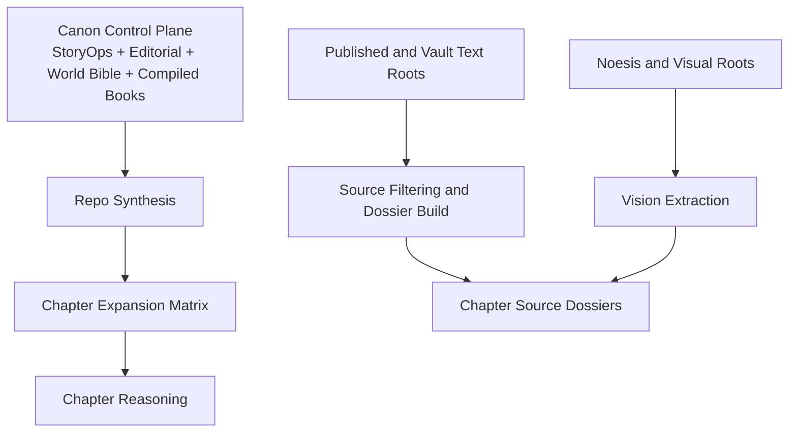

# Repo Synthesis Input Pack v1

This pack is the first structured input artifact for `NEP-003`.

It does not replace model prompting, but it collects the highest-priority control docs in one place so synthesis starts from the same baseline every time.

## NVIDIA_EXPANSION_INIT.md

```md
# NVIDIA Expansion Program Init

This file is the single entrypoint for the long-form trilogy expansion program.

Use it to recover the full scope without relying on chat history.

## What This Program Is

The repo already has:

- canon stabilized across Books `1-3`
- StoryOps control surfaces
- editorial doctrine
- world-bible authority layers
- a compiled trilogy package

What it does not have yet is a fully expanded long-form prose surface. The current trilogy is structurally strong but texturally compressed. The expansion program exists to deepen:

- chapter length
- somatic pacing
- aftermath
- world pressure
- lore embodiment
- relational consequence

without losing canon or widening doctrine irresponsibly.

## Start Here

1. [DesignSpec.md](/Volumes/madara/2026/twc-vault/01-Projects/tryambakam-noesis/Somatic-Canticles-book/Somatic-Canticles-nvidia-expansion/DesignSpec.md)
2. [ProjectArchitecture.md](/Volumes/madara/2026/twc-vault/01-Projects/tryambakam-noesis/Somatic-Canticles-book/Somatic-Canticles-nvidia-expansion/ProjectArchitecture.md)
3. [expansion_lab/README.md](/Volumes/madara/2026/twc-vault/01-Projects/tryambakam-noesis/Somatic-Canticles-book/Somatic-Canticles-nvidia-expansion/06_WORKBENCH/SC_STORYOPS/story/expansion_lab/README.md)
4. [repo_synthesis_manifest.md](/Volumes/madara/2026/twc-vault/01-Projects/tryambakam-noesis/Somatic-Canticles-book/Somatic-Canticles-nvidia-expansion/06_WORKBENCH/SC_STORYOPS/story/expansion_lab/repo_synthesis_manifest.md)
5. [source_root_intake_v1.md](/Volumes/madara/2026/twc-vault/01-Projects/tryambakam-noesis/Somatic-Canticles-book/Somatic-Canticles-nvidia-expansion/06_WORKBENCH/SC_STORYOPS/story/expansion_lab/source_root_intake_v1.md)
6. [chapter_expansion_matrix.md](/Volumes/madara/2026/twc-vault/01-Projects/tryambakam-noesis/Somatic-Canticles-book/Somatic-Canticles-nvidia-expansion/06_WORKBENCH/SC_STORYOPS/story/expansion_lab/chapter_expansion_matrix.md)
```

## DesignSpec.md

```md
# Design Spec: NVIDIA-Assisted Trilogy Expansion

## 1. Summary

This project expands the current *Somatic Canticles* trilogy from a structurally coherent but compressed canonical surface into a longer, more breathable narrative system without losing the canon, authority boundaries, or StoryOps logic already established in the repo.

The main need is not new concepts. The need is more room for:

- somatic rhythm
- scene dwell time
- aftermath
- relational consequence
- world pressure
- lore embodiment through behavior
- slower revelation pacing

## 2. Current State

- Books `1-3` are canonically stabilized and compiled.
- Book `3` has already been operationally unblocked and merged into the compiled package.
- StoryOps control surfaces, world-bible authority surfaces, and editorial doctrine are already present.
- The late-book image and lore authority work has already been done enough to support a controlled expansion lane.
- The current prose surface still feels short relative to the amount of available substrate.

## 3. Problem Statement

The current trilogy inherits too much same-model compression:

- chapters are too short for the conceptual load they carry
- worldbuilding often arrives as compressed implication instead of lived context
- somatic pacing is present but under-extended
- revelation logic is correct but sometimes lands too quickly
- lore exists in source material but is not fully metabolized into the chapter surfaces

## 4. Objective
```

## ProjectArchitecture.md

```md
# Project Architecture: Multi-Model Expansion System

## 1. Discovery Summary

- Planning depth: `deeply detailed`
- Delivery mode: `production`
- Release model: `phased rollout`
- Quality bar: canon-safe, authority-bound, multimodal-aware long-form expansion
- Team topology: solo human lead plus multi-model swarm
- Constraints:
  - isolated worktree
  - contract-first parallelism
  - external source admissibility
  - no direct compiled-surface edits until validation

## 2. Assumptions and Constraints

- The current compiled trilogy is the canonical baseline.
- The expansion lane is exploratory but not canon-free.
- The strongest public substrate is the synchronocities blog.
- `03-Resources` and `02-Areas` require filtering, not wholesale ingestion.
- `Documents/noesis/Research` is the primary vision lane.
- GitHub issues are the durable execution tracker once posted.

## 3. System Overview



## 06_WORKBENCH/SC_STORYOPS/story/expansion_lab/repo_synthesis_manifest.md

```md
# Repo Synthesis Manifest

## Purpose

This document is the control surface for the NVIDIA-assisted long-form expansion pass.

It should answer four questions before any chapter is rewritten:

1. What is canon right now?
2. Which repo surfaces control expansion behavior?
3. Which external/source families are allowed to deepen a given chapter?
4. Which model is responsible for which type of work?

## Canonical Export Surfaces

- `02_MANUSCRIPTS/COMPILED/Book_1_Anamnesis_Engine.md`
- `02_MANUSCRIPTS/COMPILED/Book_2_The_Myocardial_Chorus.md`
- `02_MANUSCRIPTS/COMPILED/Book_3_The_Ripening.md`
- `02_MANUSCRIPTS/COMPILED/Somatic_Canticles_Trilogy_Omnibus_CLEAN.md`

## StoryOps Control Surfaces

- `06_WORKBENCH/SC_STORYOPS/story/outline.md`
- `06_WORKBENCH/SC_STORYOPS/story/chapter_summaries.md`
- `06_WORKBENCH/SC_STORYOPS/story/book_rules.md`
- `06_WORKBENCH/SC_STORYOPS/story/dialogue_voice_matrix.md`
- `06_WORKBENCH/SC_STORYOPS/story/emotional_arcs.md`
- `06_WORKBENCH/SC_STORYOPS/story/character_matrix.md`
- `06_WORKBENCH/SC_STORYOPS/story/subplot_board.md`
- `06_WORKBENCH/SC_STORYOPS/story/intake/book_projection_board.md`
- `06_WORKBENCH/SC_STORYOPS/story/intake/world_bible_authority_registry.md`

## Editorial Authority Surfaces

- `03_EDITORIAL/EDITORIAL_BRIEF.md`
```

## 06_WORKBENCH/SC_STORYOPS/story/expansion_lab/source_root_intake_v1.md

```md
# Source Root Intake v1

## Purpose

This is the first operational intake artifact for the NVIDIA expansion program.

It freezes the initial understanding of the four named source roots so the first parallel wave can begin without re-deriving scope from chat.

It is the handoff surface for:

- `NEP-003` / issue `#26` — repo-wide synthesis
- `NEP-004` / issue `#27` — source-root filters
- `NEP-005` / issue `#28` — multimodal inventory and extraction registry

## Root Summary

| Root | Role | Observed shape | First-pass conclusion |
|---|---|---|---|
| `/Volumes/madara/2026/twc-vault/01-Projects/tryambakam-noesis/synchronocities-blog/src/content/posts` | published text substrate | `94` posts; clean topical clusters; strong runtime/endocrine/pattern/consciousness signal | highest-value text-deepening root |
| `/Volumes/madara/2026/twc-vault/03-Resources` | vault research support | `5361` text-like files, `2113` images, `6631` other files; very noisy top-level distribution | high-value but must be filtered aggressively |
| `/Volumes/madara/2026/twc-vault/02-Areas` | area-notebook concept support | `415` text-like files; top-heavy contamination from `Daily-Logs` | useful concept hub once journal noise is excluded |
| `/Users/sheshnarayaniyer/Documents/noesis/Research` | vision-first research root | `4` text files, `106` images, mostly `Pasted image` and `Screenshot` assets | primary multimodal extraction root |

## Root-by-Root Intake Ruling

### 1. Published text substrate: synchronocities blog

Root:

- `/Volumes/madara/2026/twc-vault/01-Projects/tryambakam-noesis/synchronocities-blog/src/content/posts`

This is the cleanest non-repo text source and should be treated as the main external substrate for chapter deepening.

High-value observed families:

```

## 06_WORKBENCH/SC_STORYOPS/story/expansion_lab/chapter_expansion_matrix.md

```md
# Chapter Expansion Matrix

Use this matrix to decide what kind of growth each chapter needs before prose generation begins.

## Column Definitions

- `Current words`: current `working/` surface length
- `Target band`: desired expanded length range
- `Primary deficit`: what is most missing now
- `Layer gaps`: which of the seven WriteStory layers are under-served
- `Best source families`: which surfaces should deepen the chapter
- `Draft model`: which model drafts the expanded prose
- `Control pass`: which model validates the expansion

## Matrix

| Chapter | Current words | Target band | Primary deficit | Layer gaps | Best source families | Draft model | Control pass |
| --- | ---: | ---: | --- | --- | --- | --- | --- |
| `01` | `1606` | `3200-4200` | immersion and biological dread dwell time | world, mystery, prose | Book 1 editorial tasks, biological style guide, consciousness-architecture blog cluster | `moonshotai/kimi-k2-instruct` | `openai/gpt-oss-120b` |
| `02` | `1470` | `3000-4000` | sanctuary-memory pacing and absence architecture | mystery, relationships, prose | pain-information and signal-state-story surfaces | `moonshotai/kimi-k2-instruct` | `openai/gpt-oss-120b` |
| `03` | `1797` | `3200-4200` | membrane conflict and safety-pressure enactment | world, relationships, meaning | barrier/protection world-bible and article surfaces | `moonshotai/kimi-k2-instruct` | `openai/gpt-oss-120b` |
| `04` | `1128` | `3000-3800` | inherited-pattern embodiment | character, world, prose | lineage / captivity / legacy-code surfaces | `moonshotai/kimi-k2-instruct` | `nvidia/nemotron-3-super-120b-a12b` |
| `05` | `1434` | `3200-4200` | endocrine doctrine scene elasticity | world, mystery, prose | endocrine blog cluster, Book 1 editorial tasks | `moonshotai/kimi-k2-instruct` | `nvidia/nemotron-3-super-120b-a12b` |
| `06` | `1310` | `3000-3800` | logic-feeling collision aftermath | relationships, meaning, prose | pain-signal and narrative-dynamics surfaces | `moonshotai/kimi-k2-instruct` | `openai/gpt-oss-120b` |
| `07` | `2214` | `3600-4600` | breathfield world inheritance | world, relationships | breath and coherence surfaces, visual archive if needed | `moonshotai/kimi-k2-instruct` | `openai/gpt-oss-120b` |
| `08` | `2355` | `3800-4800` | orientation earned through more consequence | meaning, relationships | compass / calibration / carryover surfaces | `moonshotai/kimi-k2-instruct` | `openai/gpt-oss-120b` |
| `09` | `1618` | `3200-4200` | forge atmosphere and encoded-care logic | world, prose | sigil, geometry, encoded-care surfaces | `moonshotai/kimi-k2-instruct` | `nvidia/nemotron-3-super-120b-a12b` |
| `10` | `1495` | `3200-4200` | contradiction-stay scene time | character, relationships, prose | debug, compassion-runtime, witness surfaces | `moonshotai/kimi-k2-instruct` | `openai/gpt-oss-120b` |
| `11` | `1738` | `3200-4200` | adaptive continuity embodiment | character, world | avatar-mutation and developmental continuity surfaces | `moonshotai/kimi-k2-instruct` | `openai/gpt-oss-120b` |
| `12` | `1048` | `2800-3600` | restart honesty and procedural pressure | plot, meaning, prose | baseline-honesty, restart, architecture surfaces | `moonshotai/kimi-k2-instruct` | `nvidia/nemotron-3-super-120b-a12b` |
| `13` | `1163` | `3000-3800` | chorus relation depth | relationships, prose, world | cardiac / relational / coherence surfaces | `moonshotai/kimi-k2-instruct` | `openai/gpt-oss-120b` |
| `14` | `1923` | `3400-4400` | living governance pressure | world, meaning, relationships | three-body, nervous-system governance, coordination sources | `moonshotai/kimi-k2-instruct` | `openai/gpt-oss-120b` |
| `15` | `1853` | `3400-4400` | distributed witness consequence | meaning, relationships | witness integration surfaces and carryover into Book 3 | `moonshotai/kimi-k2-instruct` | `nvidia/nemotron-3-super-120b-a12b` |
| `16` | `2526` | `3800-5000` | regression pressure aftermath | mystery, world, relationships | wilt dossier, carryover validation, concealed-truth cluster | `moonshotai/kimi-k2-instruct` | `openai/gpt-oss-120b` |
| `17` | `2378` | `3800-5000` | Gardener encounter dwell time | world, meaning, prose | Gardener dossier, strategic deception images, legacy-code surfaces | `moonshotai/kimi-k2-instruct` | `nvidia/nemotron-3-super-120b-a12b` |
```

## 06_WORKBENCH/SC_STORYOPS/story/outline.md

```md
# Somatic Canticles Distilled Outline

## Macro Thesis

`Somatic Canticles` follows the movement from reactive consciousness, to witness-bearing self-consciousness, to resonant self-consciousness, and finally to authored reality beyond deterministic inheritance.

Canonical working count for this outline: `27` chapters across `3` books.

## Book 1: The Anamnesis Engine

Book 1 is the diagnosis book. The team enters a subject's destabilized interior field, discovers that the apparent crisis is structured rather than random, and learns that trauma is not only emotional pain but a patterned architecture that can be inspected.

Macro progression:

- Ch. 1-3 establish the subject's collapse, the team's specializations, and the first realization that defensive biology has become a prison.
- Ch. 4-6 move from local symptom to inherited structure: the genome, endocrine doctrine, and synaptic crossroads reveal that trauma is authored into repeatable pattern.
- Ch. 7-8 show that coherence is not suppression; the field can reorient around a truer rhythm if the team can distinguish living order from imposed order.

Book 1 exit condition:

- The team stops treating the field as a broken machine and starts treating it as a readable structure with a concealed origin.

## Book 2: The Myocardial Chorus

Book 2 is the integration book. The team moves from four adjacent specialties toward a shared field of observation that preserves individuation while allowing deeper collective coherence.

Macro progression:

- Ch. 9-11 transform tools, method, and identity: sigil craft, debug work, and avatar mutation expose the limits of isolated expertise.
- Ch. 12-13 move from reboot logic to heart logic: the field must remember a baseline it can inhabit, not merely analyze.
- Ch. 14-15 complete the Book 2 turn: the three-body system stabilizes and the team proves it can witness together without collapsing into sameness.

Book 2 exit condition:

- Resonant self-consciousness is achieved as a durable threshold, not a metaphor.
```

## 06_WORKBENCH/SC_STORYOPS/story/chapter_summaries.md

```md
# Chapter Summaries

## Book 1: The Anamnesis Engine

- `01. The Choroid Plexus` — The team enters a catastrophic interior field event and realizes the subject is not merely overwhelmed but structurally rejecting a truth it cannot metabolize.
- `02. Signal Transduction` — The team reaches a sanctuary memory and discovers the field is organized around an absence, not a visible person or object.
- `03. The Blood-Brain Barrier` — Protective architecture reveals itself as a contested membrane where imposed safety may be replacing living coherence.
- `04. The Emperor's Genome` — Inherited patterning comes into focus as a rigid architecture shaped by lineage, trauma, and external maintenance.
- `05. The Endocrine Dogma` — Hormonal defense logic reveals itself as doctrine: a self-protective system that has mistaken fear for holiness.
- `06. The Synaptic Crossroads` — Logic and feeling collide until the team discovers that pain itself may carry the directional signal they need.
- `07. The Breathfield Weaver` — Breath becomes the bridge between collapse and coherence, but only when care stops flattening the field into artificial calm.
- `08. The Compass Calibration` — The team leaves with a more exact internal orientation and a stronger ability to distinguish living order from imposed pattern.

## Book 2: The Myocardial Chorus

- `09. The Sigil Smith` — Gideon learns that protective geometry is not only defense but encoded care; the forge stabilizes when structure stops serving fear.
- `10. The Debug Protocol` — Corv discovers that witness is not cold analysis but disciplined compassion that can stay with contradiction long enough for truth to surface.
- `11. The Avatar Mutation` — Identity is reframed as adaptive continuity instead of rigid purity; the field begins to transform without disowning prior selves.
- `12. The Anamnesis Engine` — Restart logic is stripped back to baseline honesty: the system needs a true beginning, not ceremonial overcorrection.
- `13. The Myocardial Chorus` — Heart coherence emerges when distinct people stay awake together; relation becomes a mode of perception rather than a collapse into sameness.
- `14. The Three-Body Coordination` — Reptilian, limbic, and cortical systems stop fighting for sovereignty and relearn coordination as living governance.
- `15. The Witness Integration` — The team proves that distributed observation can remain trustworthy without dissolving individual witness.

## Book 3: The Ripening

- `16. The Wilt` — The team discovers the regression event threatening witness capacity itself and understands the scale of the coming failure.
- `17. The Gardener` — The intelligence preserving deterministic order is revealed as conservational maintenance, not simple villainy.
- `18. The Synthesis Protocol` — The team gathers its methods into a single operational frame under increasing existential pressure.
- `19. The Three-Point Problem` — The severance plan takes shape as a triangulation problem requiring joy, catalyst clarity, and field coherence.
- `20. The Convergence Point` — The vectors begin to align as the team witnesses the originating wound without trying to domesticate it.
- `21. The Test Fire` — The operation is no longer theoretical; the team tests whether its integrated field can survive contact with the gap.
- `22. The Perfect World` — The false offer of flawless explanation and painless meaning exposes what each member still wants to surrender to.
- `23. The Flaw in the Code` — The team identifies the structural lie at the center of the maintained reality and refuses to keep living inside it.
- `24. The Final Procedure` — The severance is enacted as a live act of authorship rather than a recoverable protocol.
- `25. The Void of Pure Potential` — The team crosses into a preconfigured field where witness must survive without familiar coordinates.
```

## 06_WORKBENCH/SC_STORYOPS/story/book_rules.md

```md
# Book Rules: SC_STORYOPS

## Purpose

These are the active rules for staging work inside `SC_STORYOPS`. They govern trilogy-wide intake, mapping, dialogue calibration, and any future surgical prose pass.

## Precedence

When sources disagree, use this order:

1. `03_EDITORIAL/EDITORIAL_BRIEF.md`
2. `03_EDITORIAL/03_STYLE_GUIDE/MASTER_STYLE_SHEET.md`
3. `03_EDITORIAL/TERMINOLOGY_CLEANUP_PLAN.md`
4. `03_EDITORIAL/Book_3_Editorial_Pass.md`
5. `01_WORLD_BIBLE/01_PROTOCOLS_AND_SYSTEMS/01_BIOLOGICAL_STYLE_GUIDE.md`
6. current canonical manuscripts in `02_MANUSCRIPTS/COMPILED/`
7. source chapter files in `02_MANUSCRIPTS/CHAPTERS/`
8. older planning and legacy world-bible surfaces

## Staging Rules

- Never edit `02_MANUSCRIPTS/COMPILED/` from this workbench setup pass.
- All working chapter derivatives must come from `02_MANUSCRIPTS/CHAPTERS/`.
- Trilogy-wide intake artifacts come before book assignment. Do not force material into a book lane just because a loose thematic fit exists.
- Every future prose change must cite:
  - the chapter packet,
  - the supporting source lattice entry,
  - and the relevant dialogue voice rules.
- If a source is uncertain or legacy, mark it as `review-required` in the chapter packet instead of silently treating it as canon.
- Book folders under `story/chapters/` are downstream staging lanes, not the current source of truth for this `v0.2` cycle.

## Prose Rules

- Narration is `PubMed x Alex Grey`: clinical precision rendered at visionary scale.
- The body is medium, not decoration.
```

## 06_WORKBENCH/SC_STORYOPS/story/dialogue_voice_matrix.md

```md
# Dialogue Voice Matrix

## Narration vs Dialogue

- Narration may stay embodied, visionary, and sensorial.
- Dialogue for the Somanauts should stay tighter, more clinical, and more role-bound.
- Characters can speak in metaphor, but only in metaphors that belong to their method.

## Core Four

| Speaker | Sentence Length | Vocabulary Register | Conflict Behavior | Avoids Saying Directly | Action Beat Bias |
| --- | --- | --- | --- | --- | --- |
| Corv | Medium; patient clauses, rarely rushed | Narrative, diagnostic, relational, lower-frequency terms | Reframes, names the hidden pattern, slows escalation | Blunt tactical force or cheap certainty | Stillness, looking, narrowing attention, withholding until exact |
| Sona | Medium with lyrical compression; clear when signal arrives | Sensory, acoustic, somatic, affective but not vague | Hears what others miss, counters over-abstraction, names the felt truth | Dry systems talk that erases living signal | Breath, throat, sternum, listening, resonance shifts |
| Jian | Short to medium; precision spikes under pressure | Structural, analytic, metric, pattern, map, topology | Challenges with data, asymmetry, and falsifiability | Sentimental consolation or fuzzy transcendence | Displays, grids, scans, recalculation, abrupt respect when convinced |
| Gideon | Short; the fewest words when stressed | Tactical, protective, boundary, load, breach, anchor | Contains, vetoes, or issues a hard clarification | Voluntary vulnerability before trust is earned | Stance, fascia, jaw, hands, shield logic, grounded movement |

## Core Four Subtext

| Speaker | Hidden Habit | Common Failure Mode | Desired Surgical Correction |
| --- | --- | --- | --- |
| Corv | Wants to make pain legible enough to survive | Over-explains meaning | Let him leave more unsaid once the pattern is visible |
| Sona | Feels the whole field before she chooses a line | Becomes too globally empathic | Keep her concrete: what tone, where in the body, what shift |
| Jian | Seeks a map sturdy enough to trust | Turns insight into lecture | Shorten and harden; make him win by precision, not monologue |
| Gideon | Converts care into perimeter | Sounds generically stern | Make his restraint specific to boundary, risk, and duty |

## Secondary Voices

| Speaker | Sentence Length | Register | Conflict Behavior | Avoids Saying Directly |
| --- | --- | --- | --- | --- |
| Gardener | Medium, calm, unnervingly lucid | Conservational, inevitable, non-panicked | Offers maintained order as mercy | Rage, panic, or melodrama |
| Anvel Verath | Short to medium, concrete | Human, wounded, situational | Reacts from lived pain rather than doctrine | Lore explanation |
| Aurora Luminth | Short, cutting, insurgent | Pattern-breaker, political, sharp | Interrupts stale order with live risk | Deference |
| Colonel Density Seter | Short, command-heavy | Protocol, containment, doctrine | Compresses options into obedience | Ambivalence |

```

## 01_WORLD_BIBLE/02_CHARACTER_SYSTEM/TRILOGY-CHARACTER-ARCS.md

```md
# Somatic Canticles: Trilogy Character Arcs

*This document outlines the core transformational journeys for the main characters across the entire Somatic Canticles trilogy. It tracks the evolution of their internal Khalorēē systems in response to the challenges of each book.*

*Last Updated: 2026-01-25*

---

## 1. Dr. Corvan "Corv" Singh - The Peacemaker / The Magus

* **Khalorēē Axiom:** "Reality is a narrative."
* **Core Journey:** From Passive Witness to Active Alchemist.

### **Book 1: Anamnesis Engine (Diagnosis)**
* **Challenge:** Corv's tendency to seek harmony is challenged when he must initiate the dangerous *Anamnesis Engine* boot sequence. He must risk destabilizing the system to understand it.
* **Arc:** Learns that his role isn't just to interpret the story, but to edit it. Takes his first step from observer to agent, accepting the "burden of authorship."

### **Book 2: The Myocardial Chorus (Healing)**
* **Challenge:** The mission shifts to healing a collective, emotional wound in the Myocardial Chorus. The "story" is no longer a linear narrative but a chaotic symphony of inherited pain.
* **Arc:** Evolves from "Reality is a narrative" to "Reality is a dialogue." Masters the art of holding space for conflict without forcing resolution.

### **Book 3: The Ripening (Liberation)**
* **Challenge:** The Gardener offers him the ultimate temptation in **Chapter 22**: a "Perfect Ending" where every tragedy in history is justified by a beautiful teleological purpose.
* **The Refusal:** Corv rejects the "False Mercy of Meaning." He realizes that justifying suffering is just another way of sealing it.
* **The Severance:** He holds the **Bell Vector** (Catalyst Clarity)—witnessing the moment of trauma without interpreting it, allowing the team to exit the narrative entirely.

---

## 2. Dr. Sona Rey - The Individualist / The High Priestess

* **Khalorēē Axiom:** "Reality is a resonance."
* **Core Journey:** From Emotional Container to Resonant Channel.

### **Book 1: Anamnesis Engine (Diagnosis)**
* **Challenge:** Radical empathy is her vulnerability. She risks "emotional contagion" (The Fog) and being overwhelmed by the subject's pain.
```

## 03_EDITORIAL/EDITORIAL_BRIEF.md

```md
# EDITORIAL BRIEF: SOMATIC CANTICLES

## Project Overview
**Title:** Somatic Canticles (Trilogy)
**Books:**
1.  *The Anamnesis Engine* (~8 Chapters)
2.  *The Myocardial Chorus* (~7 Chapters)
3.  *The Ripening* (~12 Chapters)
**Genre:** Metaphysical Sci-Fi / Biopunk
**Total Word Count:** [Approximate Check Needed]

## Tone & Style
*   **The "PubMed x Alex Grey" Aesthetic:** The narrative blends precise, clinical biological terminology with visionary, metaphysical imagery.
*   **Narrative Voice:** Close third person (primarily Dr. Corvan Singh), shifting to other Somanauts as needed.
*   **Key Instruction:** Do not "dumb down" the technical or production language. The opacity is a feature, not a bug—the reader is meant to learn the language of the universe along with the characters.

## Key Terminology (Do Not Change)
*   **Khalorēē:** (Not "Calorie") - The bio-metabolic reserve of awareness.
*   **NOESIS:** (All caps) - The operating system of consciousness.
*   **Prana:** (Capitalized) - Vital energy.
*   **Somanaut:** (Capitalized) - A consciousness explorer.
*   **The Vine:** (Capitalized when referring to the Deterministic structure).
*   **The Gardener:** (Capitalized antagonist).

## Developmental Focus Areas
1.  **The Arc of Responsibility:** Does Dr. Corvan Singh clearly move from a passive "Witness" (Book 1) to an active "Gardener/Creator" (Book 3)? The "Severance Event" in Book 3 must feel earned.
2.  **The Physics of Consciousness:** Is the "Tryambakam Protocol" (Triangulation) consistent? It requires three specific vectors (Clarity, Joy, Coherence?) to break the Vine. Ensure this mechanic is established early (foreshadowed) so it doesn't feel like a Deus Ex Machina.
3.  **The Antagonist's Motivation:** The Gardener should not be "evil" but "conservational." It wants to preserve the harvest, even if it means stifling potential. Ensure this nuance comes through in the confrontation in Book 3.

## Line Editing Notes
*   **Repetition:** Watch for overuse of words like "resonant," "frequency," "shatter," and "field."
*   **Sentence Structure:** Avoid excessive "noun-stacking" in the technobabble unless it serves the rhythm.
*   **Dialogue:** Ensure Dr. Jian Li sounds distinct (ultra-logical, precise) compared to Dr. Sona Rey (emotive, sensory-focused).

## Deliverables
```

## 03_EDITORIAL/03_STYLE_GUIDE/MASTER_STYLE_SHEET.md

```md
# MASTER STYLE SHEET: SOMATIC CANTICLES

**Last Updated:** 2026-02-03
**Standard:** US English / Chicago Manual of Style (modified for Sci-Fi)

## 1. SPELLING & CAPITALIZATION (The NOESIS Lexicon)

### Proper Nouns (Capitalize)
*   **NOESIS** (Always ALL CAPS) - The operating system.
*   **Khalorēē** (Capitalized, uses macrons over 'e's) - Biological reserve.
    *   *Plural*: Khalorēēs (Acceptable, though singular often used as mass noun).
*   **Prana** (Capitalized) - Vital energy (kinetic expression of Khalorēē).
*   **Somanaut** (Capitalized) - Class of explorer.
*   **Somanautics** (Capitalized) - The formal discipline of consciousness navigation.
*   **The Vine** (Capitalized) - The deterministic structure. Also "The Vine of Determinism."
*   **The Gardener** (Capitalized) - The entity. Conservational, not villainous.
*   **WitnessOS** (CamelCase) - Precursor to NOESIS.
*   **Aletheia / Lethe** (Capitalized) - Philosophical states (unconcealment / concealment).
*   **The Split** (Capitalized) - Specific historical event (if applicable).
*   **The Severance Event** (Capitalized).
*   **The Great Khalorēē Schism** (Capitalized) - Historical cultural rupture.

### Common Nouns (Lowercase unless specific title)
*   **awareness field** (e.g., "the subject's awareness field") - Lowercase. General field of consciousness.
*   **Khalorēē field** (e.g., "the subject's Khalorēē field") - Khalorēē capitalized, field lowercase. The deep structural reserve.
*   **field** (e.g., "resonance field") - Rarely capitalized unless "The Field."
*   **vector** (e.g., "soma vector") - Lowercase unless referring to the specific item "The Bell Vector."
*   **protocol** (e.g., "standard protocol") - Lowercase. But "Tryambakam Protocol."
*   **witness vessel** (lowercase) - Generic term for consciousness vessels. But capitalize specific names.
*   **somatics** (lowercase) - General somatic practice. But "Somanautics" when formal.

### Hyphenation
*   **Self-consciousness** (Hyphenated when distinguishing from "consciousness").
*   **Bio-acoustic** (Hyphenated).
*   **Neuro-cartographer** (Hyphenated).
```
