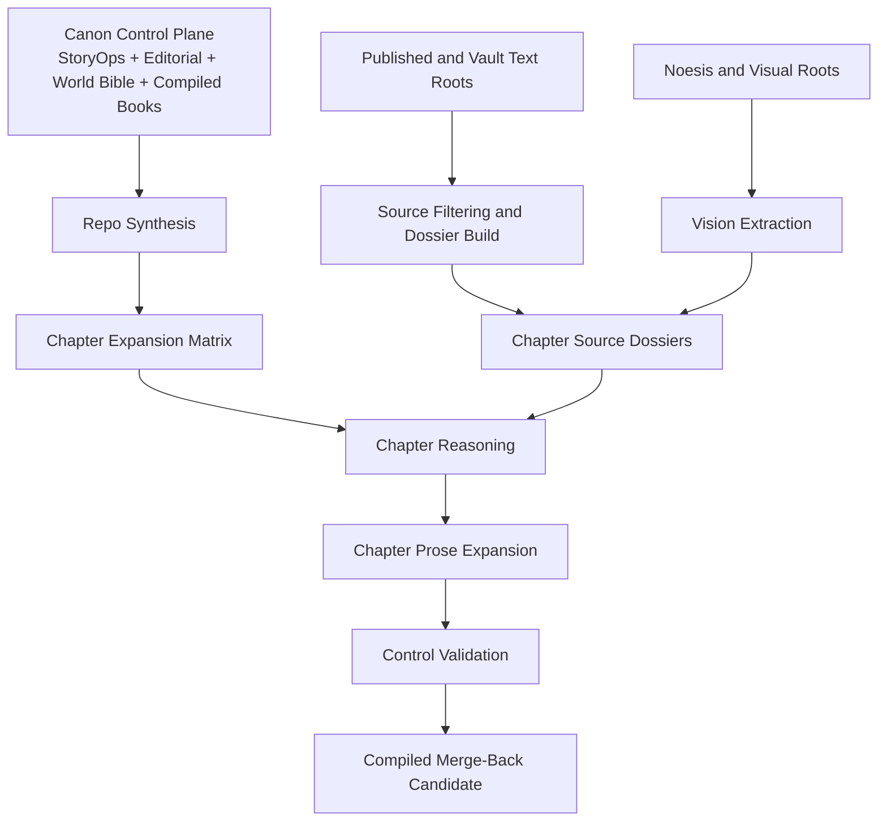

# Project Architecture: Multi-Model Expansion System

## 1. Discovery Summary

- Planning depth: `deeply detailed`
- Delivery mode: `production`
- Release model: `phased rollout`
- Quality bar: canon-safe, authority-bound, multimodal-aware long-form expansion
- Team topology: solo human lead plus multi-model swarm
- Constraints:
  - isolated worktree
  - contract-first parallelism
  - external source admissibility
  - no direct compiled-surface edits until validation

## 2. Assumptions and Constraints

- The current compiled trilogy is the canonical baseline.
- The expansion lane is exploratory but not canon-free.
- The strongest public substrate is the synchronocities blog.
- `03-Resources` and `02-Areas` require filtering, not wholesale ingestion.
- `Documents/noesis/Research` is the primary vision lane.
- GitHub issues are the durable execution tracker once posted.

## 3. System Overview

## 4. Agent and Model Ownership Model

| Concern | Primary owner | Secondary reviewer | Notes |
|---|---|---|---|
| Planning / orchestration | Codex planner | Human lead | owns issue graph and wave boundaries |
| Repo synthesis | `openai/gpt-oss-120b` | control model | whole-repo understanding, source mapping |
| Tooling / automation | `minimaxai/minimax-m2.7` | Codex planner | scripts, dossier generators, filters |
| Vision extraction | `nvidia/nemotron-3-nano-omni-30b-a3b-reasoning` | control model | images, cards, maps, diagram intake |
| Chapter reasoning | `moonshotai/kimi-k2-thinking` | Codex planner | fix pacing and scene compression before prose |
| Chapter drafting | `moonshotai/kimi-k2-instruct` | control model | actual expanded prose |
| Validation / anti-drift | `nvidia/nemotron-3-super-120b-a12b` or `openai/gpt-oss-120b` | Codex planner | canon, doctrine, lexicon, dossier compliance |

## 5. Parallel Execution Boundaries

### Frozen contracts before parallel work

Parallel work is allowed only after freezing:

- chapter dossier schema
- source-tier admissibility rules
- validation checklist
- banned/preferred vocabulary
- compiled merge-back rules

### Safe parallel lanes

These can run in parallel once the contracts are frozen:

1. repo synthesis summary generation
2. source-root filtering and indexing
3. multimodal asset inventory and extraction
4. helper-script design
5. dossier generation by chapter clusters
6. chapter reasoning by disjoint chapter sets
7. prose expansion by disjoint chapter sets
8. control validation by disjoint chapter sets

### Serialized lock zones

These remain serialized:

- `tasks/todo.md`
- `tasks/lessons.md`
- core `expansion_lab` contract files
- compiled merge-back surfaces
- glossary / bibliography / endmatter exports

## 6. Phase Map

### Phase 1 — Contract and memory foundation

Goal:
- persist the expansion program in repo-local docs
- freeze source tiers, model roles, and validation rules

Exit criteria:
- spec, architecture, issue map, and source contracts exist
- GitHub tracking is ready

### Phase 2 — Synthesis and source intelligence

Goal:
- build the repo synthesis layer, source filters, and multimodal extraction registry

Exit criteria:
- usable repo synthesis artifact
- source inventories
- dossier generation inputs ready

### Phase 3 — Dossier generation and tooling

Goal:
- produce chapter-bound source dossiers for `Chapter 01-27`
- build the helper scripts needed to scale dossier production

Exit criteria:
- every chapter has a dossier
- provenance and admissibility are explicit

### Phase 4 — Parallel chapter expansion

Goal:
- expand Book `1`, Book `2`, and Book `3` through controlled multi-model passes

Exit criteria:
- expanded working chapters complete
- chapter-level validation evidence exists

### Phase 5 — Integration, compiled rebuild, and release prep

Goal:
- rebuild compiled books and omnibus from validated expansion outputs

Exit criteria:
- compiled surfaces rebuilt
- consistency scans pass
- editorial package is release-ready

## 7. Detailed Phase 1 Waves

### Wave 1 — Contract freeze

#### Swarm A — Expansion control packet
- Goal: freeze source tiers, model roles, and dossier rules
- Owner: planner/orchestrator
- Outputs: spec, architecture, expansion-lab contract docs
- Validation: contract docs exist and cross-link correctly

#### Swarm B — GitHub execution mapping
- Goal: convert the plan into durable issue-tracked work
- Owner: planner/orchestrator
- Outputs: issue map, labels, milestones, issue bodies
- Validation: dependencies and ownership are explicit

### Wave 2 — Source intelligence scaffolding

#### Swarm A — Text substrate indexing
- Goal: classify blog, `03-Resources`, and `02-Areas`
- Owner: synthesis/tooling lane
- Outputs: source inventory, filter rules
- Validation: excluded families are explicit and admissibility is encoded

#### Swarm B — Vision intake scaffolding
- Goal: inventory noesis and blog visuals for extraction
- Owner: multimodal lane
- Outputs: asset inventory, extraction plan, registry schema
- Validation: provenance and corroboration fields exist

### Wave 3 — Dossier-launch baseline

#### Swarm A — Chapter matrix enforcement
- Goal: make the matrix operational as a production planning surface
- Owner: synthesis lane
- Outputs: chapter priorities, target bands, missing-layer map
- Validation: matrix aligns with chapter summaries and StoryOps

#### Swarm B — Tooling and validation baseline
- Goal: script the repeatable pieces and define proof gates
- Owner: tooling/validation lane
- Outputs: helper scripts plan, validation gate checklist
- Validation: every future wave has evidence requirements

## 8. GitHub Sync Strategy

- one issue per swarm-sized work item by default
- one owner per issue
- one branch/worktree per implementation issue
- dependencies encoded in issue bodies
- wave summaries captured in the repo and optionally in GitHub comments

The concrete issue plan lives in:
[github_issue_map.md](/Volumes/madara/2026/twc-vault/01-Projects/tryambakam-noesis/Somatic-Canticles-book/Somatic-Canticles-nvidia-expansion/06_WORKBENCH/SC_STORYOPS/story/expansion_lab/github_issue_map.md)

## 9. Verification Strategy

- task-level evidence for every issue
- wave-level validation gates before launching the next parallel batch
- no visual extract used without provenance and corroboration
- no compiled merge-back before chapter validation passes
- `git diff --check` and consistency scans for repo-local proofs

## 10. Risks and Fallbacks

- Risk: source material becomes an unbounded lore dump
  - Fallback: dossier admissibility and chapter-local source caps
- Risk: vision extraction overclaims ontology
  - Fallback: require textual corroboration before structural use
- Risk: multiple models touch the same chapter surface with no frozen contract
  - Fallback: split by artifact, not by chat convenience
- Risk: chat becomes the only memory layer again
  - Fallback: update repo-local spec, architecture, and issue map before new waves
